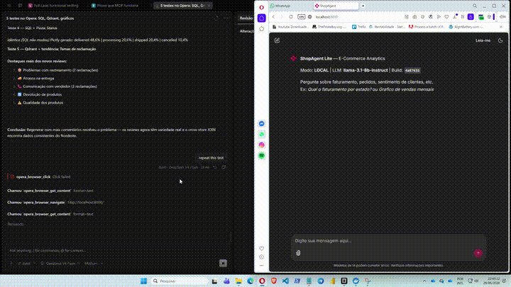
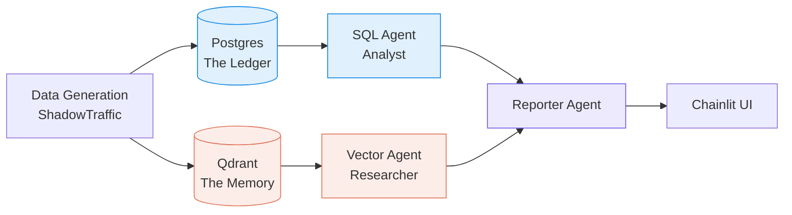

<!--
  Semana AI Data Engineer — Workshop / study materials
  README.md  |  github.com/laurentaf/semana-ai-data-engineer
  Brand: What can you do now that you couldn't before?
  Tone: Educational, inviting, bilingual.
  Adapted from the LAOS README (20/20) inline-HTML pattern.
-->

<div align="center" style="margin-top:48px;margin-bottom:24px;">

<!-- Emblem: AI / brain + data nodes -->
<svg width="72" height="72" viewBox="0 0 64 64" fill="none" xmlns="http://www.w3.org/2000/svg" style="margin-bottom:4px;">
  <rect x="4" y="4" width="56" height="56" rx="12" stroke="#e17055" stroke-width="1.5" fill="none" opacity="0.3"/>
  <!-- Brain shape -->
  <path d="M32 14 C24 14 18 18 18 26 C18 30 20 34 24 36 C20 38 18 42 18 46 C18 52 24 54 32 54 C40 54 46 52 46 46 C46 42 44 38 40 36 C44 34 46 30 46 26 C46 18 40 14 32 14Z" stroke="#e17055" stroke-width="1.8" fill="none"/>
  <!-- Neural lines -->
  <path d="M24 28 Q32 24 40 28" stroke="#e17055" stroke-width="1.2" opacity="0.5" fill="none"/>
  <path d="M24 34 Q32 38 40 34" stroke="#e17055" stroke-width="1.2" opacity="0.5" fill="none"/>
  <path d="M28 24 L28 40" stroke="#e17055" stroke-width="0.8" opacity="0.3"/>
  <path d="M36 24 L36 40" stroke="#e17055" stroke-width="0.8" opacity="0.3"/>
  <!-- Data nodes -->
  <circle cx="14" cy="14" r="3" fill="#e17055" opacity="0.5"/>
  <circle cx="50" cy="14" r="3" fill="#e17055" opacity="0.5"/>
  <line x1="17" y1="16" x2="22" y2="18" stroke="#e17055" stroke-width="1" opacity="0.3"/>
  <line x1="47" y1="16" x2="42" y2="18" stroke="#e17055" stroke-width="1" opacity="0.3"/>
</svg>

<br/>

# Semana AI Data Engineer

### ShopAgent &bull; Multi-Agent Systems &bull; 4 Phases &bull; From Zero to Cloud

<p style="margin:12px 0;">
  
  &nbsp;
  
  &nbsp;
  
  &nbsp;
  
  &nbsp;
  <a href="https://github.com/laurentaf/laos"></a>
</p>

<br/>

<p style="font-size:0.85em;color:#636e72;">
  EN: Build a multi-agent AI system that queries structured and semantic e-commerce data — live, in 4 phases.
  <br/>
  PT: Construa um sistema multi-agente que consulta dados estruturados e semânticos de e-commerce — ao vivo, em 4 fases.
</p>

<hr style="width:48px;margin:24px auto;border:none;border-top:2px solid #e17055;opacity:0.3;"/>

</div>

## Media

<p align="center">
  
  <br>
  <em>ShopAgent em ação — preview acelerado (10s). Link do YouTube em breve.</em>
</p>

> **Video file:** `video_ai_engineer.mp4` is gitignored (too large for the repo).
> The GIF preview lives in `docs/video-preview.gif`.
> To regenerate the GIF from the source MP4:
> ```bash
> ffmpeg -i video_ai_engineer.mp4 -vf "fps=10,scale=720:-1:flags=lanczos,setpts=PTS/6.22" -loop 0 docs/video-preview.gif
> ```
> *(Adjust `PTS/6.22` ratio if video duration changes)*

---

> **O que você consegue fazer agora que não conseguia antes?**  
> ShopAgent é um sistema multi-agente autônomo construído sobre dados reais de e-commerce. Ele roteia perguntas de negócio para o armazenamento certo: SQL para números exatos, vetores para sentimento do cliente. Dias 1-3 rodam 100% local com Docker. Dia 4 migra a mesma arquitetura para a nuvem.

---

## O que é

**ShopAgent** é o projeto prático da Semana AI Data Engineer 2026 — uma jornada de 4 fases construindo um sistema multi-agente do zero. Cada fase introduz uma nova camada: ingestão, contexto, agente inteligente e, finalmente, um crew multi-agente com orquestração completa.

**Por que existe:** Teoria sem prática não forma engenheiro de dados. ShopAgent é o laboratório onde você toca em cada componente — dados, embeddings, LLMs, agentes — e vê como eles se conectam para resolver um problema real de e-commerce.

---

## Arquitetura



<div align="center" style="margin:24px 0;">

<table style="border-collapse:separate;border-spacing:0;min-width:560px;">
  <tr>
    <td colspan="4" align="center" style="padding:0 0 8px 0;">
      <div style="display:inline-block;border:1.5px solid #e17055;border-radius:8px;padding:12px 24px;text-align:center;">
        <div style="font-weight:700;font-size:1em;letter-spacing:0.04em;color:#e17055;">ShopAgent — Multi-Agent Architecture</div>
        <div style="font-size:0.8em;opacity:0.5;">CrewAI · NVIDIA NIM · Qdrant · Postgres · Chainlit</div>
      </div>
    </td>
  </tr>
  <tr><td colspan="4" align="center" style="padding:0;"><div style="width:1.5px;height:14px;background:#e17055;opacity:0.2;margin:0 auto;"></div></td></tr>
  <tr>
    <td align="center" style="padding:0 6px;width:25%;">
      <div style="border:1px solid #0984e3;border-radius:6px;padding:8px 10px;text-align:center;">
        <div style="font-weight:600;font-size:0.8em;letter-spacing:0.02em;color:#0984e3;">The Ledger</div>
        <div style="font-size:0.65em;opacity:0.5;">Postgres<br/>Dados exatos</div>
      </div>
    </td>
    <td align="center" style="padding:0 6px;width:25%;">
      <div style="border:1px solid #e17055;border-radius:6px;padding:8px 10px;text-align:center;">
        <div style="font-weight:600;font-size:0.8em;letter-spacing:0.02em;color:#e17055;">The Memory</div>
        <div style="font-size:0.65em;opacity:0.5;">Qdrant<br/>Reviews + RAG</div>
      </div>
    </td>
    <td align="center" style="padding:0 6px;width:25%;">
      <div style="border:1px solid #6c5ce7;border-radius:6px;padding:8px 10px;text-align:center;">
        <div style="font-weight:600;font-size:0.8em;letter-spacing:0.02em;color:#6c5ce7;">3-Agent Crew</div>
        <div style="font-size:0.65em;opacity:0.5;">Analyst · Researcher<br/>Reporter</div>
      </div>
    </td>
    <td align="center" style="padding:0 6px;width:25%;">
      <div style="border:1px solid #00b894;border-radius:6px;padding:8px 10px;text-align:center;">
        <div style="font-weight:600;font-size:0.8em;letter-spacing:0.02em;color:#00b894;">Interface</div>
        <div style="font-size:0.65em;opacity:0.5;">Chainlit<br/>Chat UI</div>
      </div>
    </td>
  </tr>
</table>

</div>

---

## Jornada: 4 Fases

| Dia | Tema | Stack |
|-----|------|-------|
| **1** 🗓️ | **INGERIR** — Dados, pipeline, schema | ShadowTraffic, Pydantic, Docker |
| **2** 🗓️ | **CONTEXTUALIZAR** — Embeddings + busca semântica | FastEmbed, Qdrant, Postgres, MCP |
| **3** 🗓️ | **AGENTE** — Primeiro agente autônomo | LangChain, Chainlit, AgentSpec |
| **4** 🗓️ | **MULTI-AGENTE** — Crew orquestrado na nuvem | CrewAI, NVIDIA NIM, DeepEval, LangFuse |

---

## Modelo de Dados

| Entidade | Armazenamento | Campos |
|----------|--------------|--------|
| `customers` | Postgres | customer_id, name, email, city, state, segment |
| `products` | Postgres | product_id, name, category, price, brand |
| `orders` | Postgres | order_id, customer_id, product_id, qty, total, status, payment, created_at |
| `reviews` | JSONL → Qdrant | review_id, order_id, rating, comment, sentiment |

**The Ledger (Postgres):** Dados exatos — receita, contagens, médias, JOINs.

**The Memory (Qdrant):** Significado — reclamações, sentimento, temas de reviews via RAG.

---

## 3-Agent Crew (Dia 4)

| Agent | Função | Fonte de Dados | LLM |
|-------|--------|----------------|-----|
| **AnalystAgent** 📊 | Analista SQL | The Ledger (Postgres) | NVIDIA NIM |
| **ResearchAgent** 🔍 | Pesquisador de experiência do cliente | The Memory (Qdrant) | NVIDIA NIM |
| **ReporterAgent** 📝 | Escritor de relatório executivo | Ambos via contexto | NVIDIA NIM |

---

## Quick Start

### Pré-requisitos

- Docker Desktop
- Chave API Anthropic
- Licença ShadowTraffic (trial gratuito em [shadowtraffic.io](https://shadowtraffic.io/))

### Modo Local (Dias 1-3)

```bash
git clone https://github.com/laurentaf/semana-ai-data-engineer.git
cd semana-ai-data-engineer

# Configurar ambiente
python -m venv .venv
# Windows: .venv\Scripts\activate
# Linux/Mac: source .venv/bin/activate
pip install -r src/requirements.txt

# Configurar variáveis
cd gen
cp .env.example .env
cp license.env.example license.env
# Adicionar ANTHROPIC_API_KEY em .env
# Preencher license.env com dados da ShadowTraffic

# Subir infraestrutura
docker compose up -d
# → Postgres na 5432, Qdrant na 6333, ShadowTraffic gerando dados
```

### Modo Cloud (Dia 4)

```bash
# 1. Definir ENVIRONMENT=cloud no .env
# 2. Configurar credenciais cloud (Supabase, Qdrant Cloud, LangFuse)
# 3. Migrar dados:
python src/migrate_to_cloud.py
# 4. Fazer deploy no Render (gratuito, sem cartão)
```

---

## Infraestrutura

| Serviço | Local | Cloud |
|---------|-------|-------|
| Postgres | Docker (localhost:5432) | Supabase (REST + RPC) |
| Qdrant | Docker (localhost:6333) | Qdrant Cloud (HTTPS) |
| LLM | NVIDIA NIM API | NVIDIA NIM (funciona em ambos) |
| Observabilidade | — | LangFuse Cloud |
| Interface | Chainlit local | Render (deploy gratuito) |

---

## Deploy Gratuito

1. Faça push para o GitHub
2. Acesse [render.com](https://render.com) > New > Web Service
3. Conecte o repositório (Render detecta `render.yaml`)
4. Adicione env vars: `SUPABASE_URL`, `SUPABASE_KEY`, `NVIDIA_NIM_API_KEY`, etc.
5. Deploy — app live em `https://shopagent-xxxx.onrender.com`

> Free tier desliga após 15 min inativo (cold start ~30s). Perfeito para demo/POC.

---

## Contributing

| Escopo | Caminho |
|--------|---------|
| **Bug / melhoria** | Abra uma [issue](https://github.com/laurentaf/semana-ai-data-engineer/issues) |
| **Novo conteúdo / dia** | PR com descrição + curriculum |
| **Documentação** | PR — sem gate |

---

## License

<div style="margin:16px 0;">

**MIT** — veja [`LICENSE`](https://github.com/laurentaf/semana-ai-data-engineer/blob/main/LICENSE) para o texto completo.

O que você consegue fazer agora que não conseguia antes?

</div>

---

<div align="center" style="margin:36px 0;opacity:0.25;font-size:0.8em;">
<svg width="28" height="28" viewBox="0 0 64 64" fill="none" xmlns="http://www.w3.org/2000/svg" style="margin-bottom:4px;">
  <rect x="4" y="4" width="56" height="56" rx="12" stroke="#e17055" stroke-width="1.5" fill="none" opacity="0.15"/>
  <path d="M32 16 C26 16 22 20 22 26 C22 30 24 33 27 35 C24 37 22 40 22 44 C22 48 26 50 32 50 C38 50 42 48 42 44 C42 40 40 37 37 35 C40 33 42 30 42 26 C42 20 38 16 32 16Z" stroke="#e17055" stroke-width="1.5" fill="none" opacity="0.5"/>
  <circle cx="14" cy="16" r="2" fill="#e17055" opacity="0.4"/>
  <circle cx="50" cy="16" r="2" fill="#e17055" opacity="0.4"/>
</svg>
<br/>
Semana AI Data Engineer — parte do ecossistema <a href="https://github.com/laurentaf/laos" style="text-decoration:none;">LAOS</a>
</div>